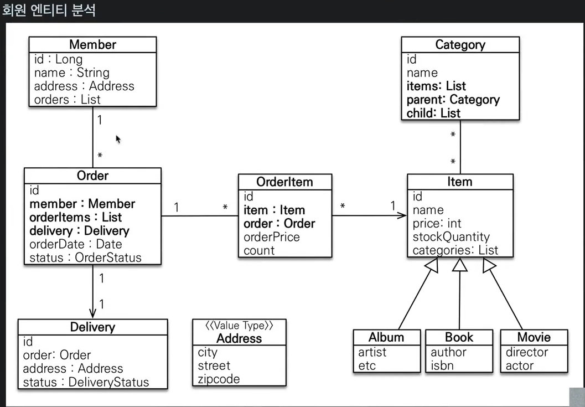

# 도메인 분석 설계
## 요구사항 분석
- 회원 기능
    - 회원 등록
    - 회원 조회
- 상품 기능
    - 상품 등록
    - 상품 수정
    - 상품 조회
- 주문 기능
    - 상품 주문
    - 주문 내역 조회
    - 주문 취소
- 기타 요구사항
    - 상품은 재고 관리가 필요
    - 상품의 종류는 도서,음반,영화가 있음
    - 상품을 카테고리로 구분 가능
    - 상품 주문 시 배송 정보 입력 가능

## 엔티티 설계 시 주의사항

### 엔티티에는 가급적 Setter를 사용하지 말자
- Setter가 모두 열려있으면 변경 포인트가 많아서 유지보수가 힘들다

### 모든 연관 관게는 지연로딩으로 설정
- 즉시로딩은 예측이 어렵고, 어떤 SQL이 실행될지 추적하기 어렵다. 특히 JPQL을 실행할 때 N + 1 문제가 자주 발생
- 실무에서 모든 연관관계는 지연로딩으로 설정
- 연관된 엔티티를 함께 DB 조회해야하면 fetch join 또는 엔티티 그래프 기능을 사용한다.
- @XtoOne 관계는 기본이 즉시로딩이므로 직접 지연로딩 설정을 해야 한다.

### 컬렉션은 필드에서 초기화 하자 
- 컬렉션은 필드에서 바로 초기화 하는 것이 안전하다.
- null 문제에서 안전하다.
- 하이버네이트는 엔티티를 영속화 할 때, 컬렉션을 감싸서 하이버네이트에서 제공하는 내장 컬렉션으로
- 변경한다. 만약 getOrders()처럼 임의의 메서드에서 컬렉션을 잘못 생성하면 하이버네이트 내부
- 매커니즘에 문제가 발생할 수 있다.

## 테이블, 컬럼명 생성 전략

### 스프링 부트 신규 설정(엔티티(필드) => 테이블(컬럼))
1. 카멕 케이스 -> 언더스코어
2. . -> 언더스코어
3. 대문자 -> 소문자